# 良夜(GoodNight)

**[English](./README.md) | 简体中文**

安卓工作/休息循环计时器,带 GitHub 风格的每日专注热力图。后台可靠运行:精确闹钟、强杀/重启自愈、跨午夜落账。

> 名字取自狄兰·托马斯的诗句「不要温和地走进那个良夜」(Do not go gentle into that good night)。

## 目录

- [背景](#背景)
- [功能](#功能)
- [安装](#安装)
- [使用](#使用)
- [架构](#架构)
- [测试](#测试)
- [致谢](#致谢)
- [许可证](#许可证)

## 背景

番茄工作法类应用的核心矛盾是"后台可靠性":锁屏、强杀、重启、跨午夜都要不丢账。良夜用前台服务 + 精确闹钟 + 双时钟(单调钟计时/墙钟对账)引擎解决这一问题,并以每日热力图呈现长期专注历史。

## 功能

- 工作/休息双时长自动循环切换,后台持续运行(通知实时倒计时 + 阶段进度条 + 暂停/跳过/终止图标动作)
- 全历史每日专注热力图:虚拟化懒加载网格,月份标签、图例、连续圆角融合;点击任意日期展开按配置分解的详情卡
- 多套命名时长配置,各自累计总时长
- 暂停/恢复/跳过/终止;终止结束整轮循环并清零循环计数;暂停后改时长立即按新时长重开
- 时间到声音+震动提醒,自动停止,无需手动关闭
- 强杀后重开应用自动对账恢复;整机重启后自动恢复计时
- 每日累计按 60 秒节奏落账,跨午夜分日记账(误差 <= 60 秒)
- Material You 动态取色(Android 12+,以下回退为烬橙)与 edge-to-edge 布局
- 描边图标体系(Lucide 几何),播放/暂停弹性形变切换、按压缩放与循环徽标弹跳;遵循系统"关闭动画"设置
- 真实路径级图标形变(播放三角分裂为暂停双竖条),纯 Kotlin 引擎(SVG 弧长重采样/Procrustes 对齐/极坐标插值),动作区错峰重排与状态文本过渡
- 每配置可选正计时模式(秒表语义:手动暂停/终止,无自动阶段轮换),默认仍为倒计时,新建/编辑配置时选择
- 周报/月报专注报表(按日或按周汇总 + 各配置合计),入口在设置页
- 首次安装为全空引导态(不再预置演示配置);升级经非破坏性迁移完整保留数据。热力图直角方格与逐列月份标签常显;开始按钮图标化,动作键统一 56dp
- 顶栏重构:中央配置切换下拉 + 右侧菜单(周报/月报直达);热力图格 2dp 圆角、首条记录前日期留白、月份标签按 GitHub 模式显示;周日与月末自动推送专注汇总通知(该期无记录不打扰);其余状态切换统一接入弹性/补间动效
- 顶栏下拉改为全宽展开面板(配置切换/报表菜单),面板展开时页面内容顺沿下移动画过渡,替代悬浮菜单。配置管理独立成页,入口固定在配置面板顶部;设置页精简为权限横幅与提醒强度。
- 返回导航适配手势/三键:主屏返回最小化到后台不退出,子屏返回统一回主页;全应用文案「配置」统一为「时钟」。报表新增第三个页签「时钟累计」(各时钟起用至今),时钟管理页卡片统计行移入其中,新建按钮收进标题栏「+」。热力图每日详情在每个时钟的累计时长下新增各段专注的 开始~结束(时:分);专注段跨午夜自动在 00:00 切分归属各日,兼容旧版本历史数据。
- 全应用中英文双语(跟随系统:非中文环境默认英文,中文入 values-zh),覆盖报表/通知/设置/时段明细;报表菜单与页签对齐(周报/月报/时钟累计)且分段按钮均衡。时钟管理改为点卡片即编辑;垃圾桶图标进入删除模式,勾选多删由底部「删除选中」批量执行。
- 周报/月报改为健康报表风:总时长 + 较上期增减、专注天数、连续、日均、最佳单日、时段分布;按钮图标动画零闪帧(几何缓存、逐帧不重建 Path);通知栏始终最多一条(单渠道单 ID)。
- 页面切换改为平缓淡入淡出;不足 1 分钟的专注段按误触处理:不计入、不显示、不存储,升级时一次性清理历史误触段并扣回合计;报表第三页签更名「总时长」,内容与周/月报同样式健康摘要。
- 页面切换改为等时交叉淡化(两屏透明度恒相加=1,无空白帧/白屏跳闪);周报/月报/总报重构:摘要 Hero 卡 + 指标格 + 时段分布条 + 每日/每时钟比例条形图。
- 报表时段分布标签仅保留名称(上午/下午/晚上/深夜);新增 7 套配色包(经典橙/浅绿/蓝/紫/玫红/青/暮色,参考 GitHub 高星配色库),在设置页切换,持久化,固定浅色。

## 安装

要求:Android 8.0(API 26)及以上。

- 从 [Releases](https://github.com/Zzz210s/GoodNight/releases) 下载 APK 安装(v0.3.0 起为正式签名版可直接安装;注意从 v0.2.0 调试签名版升级需先卸载)
- 或从源码构建:

```bash
git clone https://github.com/Zzz210s/GoodNight.git
cd GoodNight
./gradlew :app:assembleDebug
# 产物: app/build/outputs/apk/debug/app-debug.apk
```

构建签名 release:生成 keystore 后在 `local.properties` 配置 `storeFile`/`storePassword`/`keyAlias`/`keyPassword` 四键;缺省时 release 构建回落 debug 签名。

## 使用

1. 首次启动授予通知权限
2. (可选)在设置页新建自己的时长配置
3. 主页点"开始"即进入工作/休息循环
4. 阶段结束会有提示音与提醒通知;暂停、跳过、终止可在应用或通知上进行
5. 主页热力图点击任意日期查看当日累计与按配置分解

## 架构

单模块 Compose 应用,分层清晰:



- `timer/` 纯 Kotlin 计时引擎(状态机、checkpoint 对账、双时钟恢复),无 Android 依赖,可 JVM 直测
- `service/` 前台服务(事件驱动:通知/闹钟/提醒/落账)、精确闹钟调度、开机/闹钟接收器
- `data/` Room(profile、daily_total)+ DataStore(设置、运行时状态)
- `ui/` Compose(Material 3):主页(计时卡+热力图)、设置页

计时正确性设计:引擎事件 replay=0 + 订阅握手、单一互斥锁串行化全部驱动路径、结算归属事件携带(抗 RESET/换配置交错)、排空感知的服务拆除。

## 测试

87 个单元测试(JVM + Robolectric)覆盖引擎语义、事件策略、接收器门控、ViewModel 契约:

```bash
./gradlew test
```

## 致谢

- 后台计时可靠性设计参考 [adrcotfas/goodtime](https://github.com/adrcotfas/goodtime)(GPL-3.0)
- 热力图与每日聚合数据模型设计参考 [nsh07/Tomato](https://github.com/nsh07/Tomato)(GPL-3.0)

本项目为独立实现,未复制上述项目源代码(见 [NOTICE](NOTICE))。

## 贡献

见 [CONTRIBUTING.md](CONTRIBUTING.md)。变更记录见 [CHANGELOG.zh-CN.md](CHANGELOG.zh-CN.md)。

## 许可证

[GPL-3.0](LICENSE)
